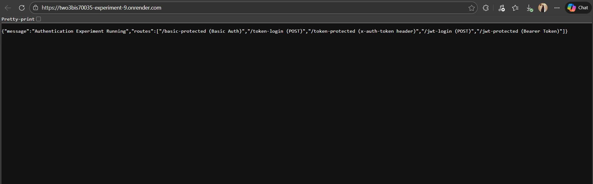
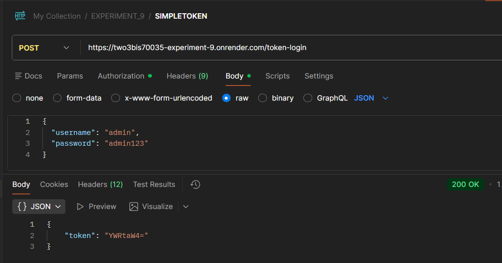
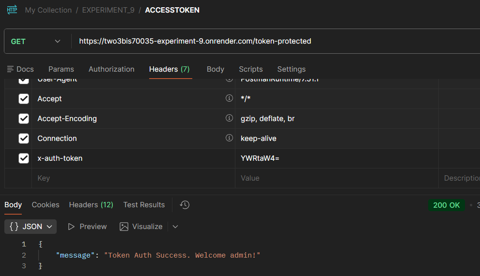

## Experiment No. 9 - Implement authentication using JWT

## Project Structure

```bash
Experiment_9/
├── venv/
│   ├── Include/
│   ├── Lib/
│   └── Scripts/
├── requiement.txt
├── app.py
└── README.md
```

## JWT Methods
|Method      | Header Used           | Stateless? | Secure?     |
|------------|---------------------|----------|----------- |
| Basic Auth   | Authorization         | Yes        | Weak      |
| Base64 Token | x-auth-token          | Yes        | Very Weak |
| JWT          | Authorization: Bearer | Yes        | Strong    |

## STEPS & SCREENSHOTS

### 1. Server Start & Running


Render development server successfully started.

### 2. Basic Protected (GET)


Logging in using basic authorization

### 3. Token Login (POST)



### Token Protected(GET)



### 4. JWT Login


### 5. JWT Token Verification

### Using Bearer Token


| Method | Endpoint         | Description                              |
| ------ | ---------------- | ---------------------------------------- |
| GET    | /                | API status and available routes          |
| GET    | /basic-protected | Basic Authentication protected route     |
| POST   | /token-login     | Generate simple Base64 token             |
| GET    | /token-protected | Access route using `x-auth-token` header |
| POST   | /jwt-login       | Generate JWT access token                |
| GET    | /jwt-protected   | Access route using JWT Bearer token      |

## Learning Outcome

- Learnt about backend technologies
- Learnt to create virtual enviroment of python using venv
- Learnt about differnet authentication methods
- learnt about JWT Tokens
- Leant to code in flask
- Learnt about flask in python
- Learnt to route in flask