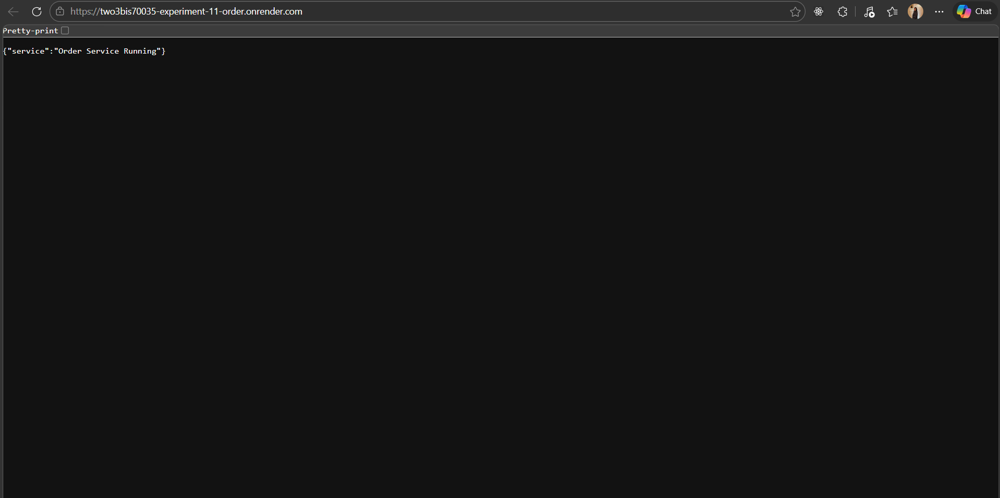
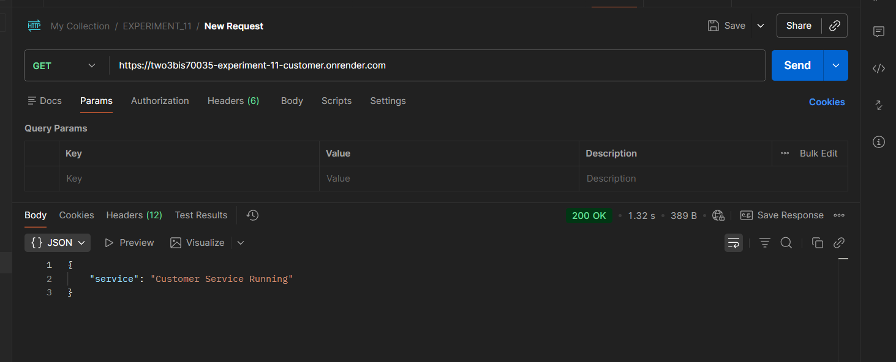
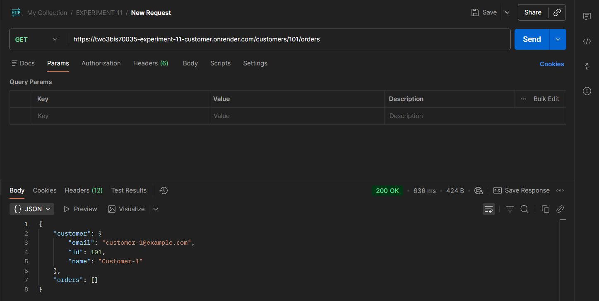
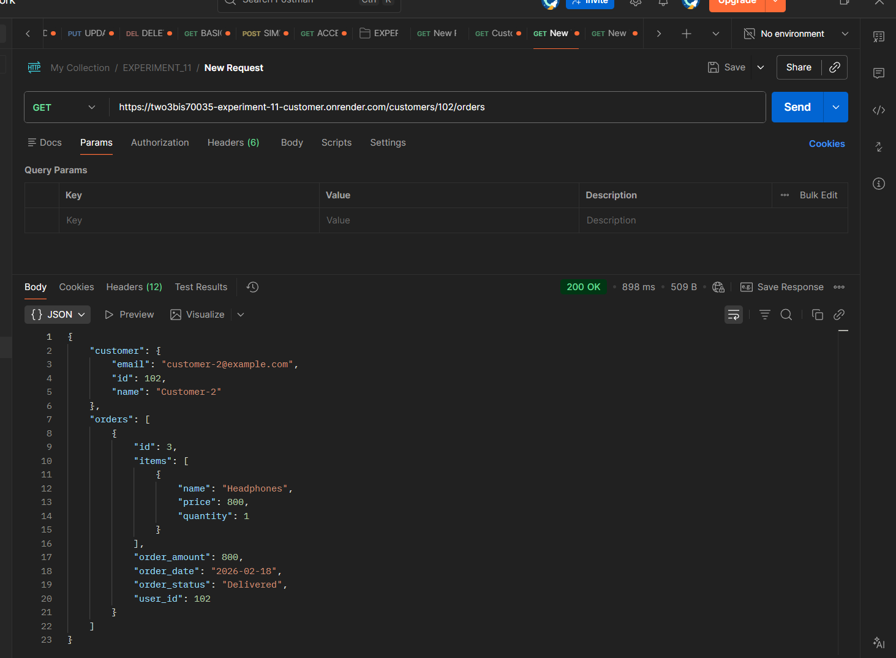
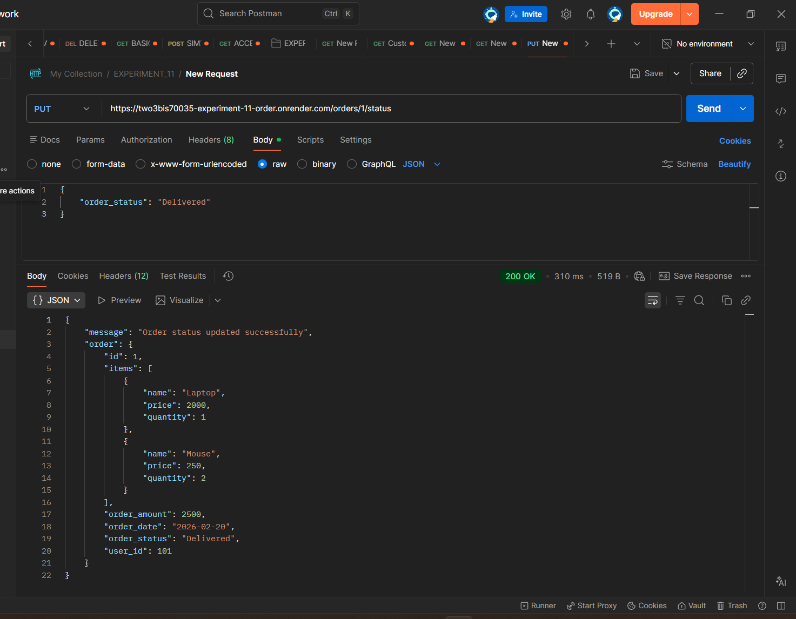

# Experiment 11 – Microservices-Based Backend Module

## Objective
To develop a **microservices-based backend system** using Flask, where:
- One service handles **Customer data**
- Another service handles **Order data**
- Services communicate using **HTTP requests**

## Project Structure

```
micro-services-lab/
│
├── customer-service/
│   ├── customer_app.py
│   └── requirements.txt
│
├── order_service/
│   ├── order_app.py
│   └── requirements.txt
│
└── README.md
```

## ⚙️ Technologies Used
- Python (Flask)
- Requests Library
- Postman (API Testing)
- Render (Deployment)

## Microservices Overview

### 1. Customer Service

- Stores customer data (in-memory)
- Fetches customer details
- Calls Order Service to retrieve orders

**Endpoint:** GET /customers/<user_id>/orders

### 2. Order Service

- Stores order data (in-memory)
- Retrieves orders for a user
- Updates order status

**Endpoints:**
- GET /orders/user/<user_id>
- PUT /orders/<order_id>/status

## Source Code

### Customer Service (`customer_app.py`)

```python
from flask import Flask, jsonify
import requests

app = Flask(__name__)

customers = {
    101: {"id": 101, "name": "Customer-1", "email": "customer-1@example.com"},
    102: {"id": 102, "name": "Customer-2", "email": "customer-2@example.com"}
}

@app.route("/customers/<int:user_id>/orders")
def get_account_details(user_id):
    customer = customers.get(user_id)

    if not customer:
        return jsonify({"error": "Customer not found"}), 404

    try:
        response = requests.get(
            f"https://two3bis70035-experiment-11-order.onrender.com/orders/user/{user_id}",
            timeout=3
        )

        if response.status_code == 200:
            orders = response.json()
        else:
            orders = []
    except requests.exceptions.RequestException:
        orders = []

    return jsonify({
        "customer": customer,
        "orders": orders
    })

@app.route("/")
def home():
    return jsonify({"service": "Customer Service Running"})

if __name__ == "__main__":
    app.run(port=5001, debug=True)
```

---

### Order Service (`order_app.py`)

```python
from flask import Flask, jsonify, request

app = Flask(__name__)

orders = [
    {
        "id": 1,
        "user_id": 101,
        "order_date": "2026-02-20",
        "order_amount": 2500,
        "order_status": "Shipped",
        "items": [
            {"name": "Laptop", "quantity": 1, "price": 2000},
            {"name": "Mouse", "quantity": 2, "price": 250}
        ]
    },
    {
        "id": 2,
        "user_id": 101,
        "order_date": "2026-02-22",
        "order_amount": 1200,
        "order_status": "Processing",
        "items": [
            {"name": "Keyboard", "quantity": 1, "price": 1200}
        ]
    },
    {
        "id": 3,
        "user_id": 102,
        "order_date": "2026-02-18",
        "order_amount": 800,
        "order_status": "Delivered",
        "items": [
            {"name": "Headphones", "quantity": 1, "price": 800}
        ]
    }
]

@app.route("/orders/user/<int:user_id>")
def get_orders_by_user(user_id):
    user_orders = [o for o in orders if o["user_id"] == user_id]
    return jsonify(user_orders)

@app.route("/orders/<int:order_id>/status", methods=["PUT"])
def update_order_status(order_id):
    data = request.get_json()
    new_status = data.get("order_status")

    if not new_status:
        return jsonify({"error": "order_status is required"}), 400

    for order in orders:
        if order["id"] == order_id:
            order["order_status"] = new_status
            return jsonify({
                "message": "Order status updated successfully",
                "order": order
            })

    return jsonify({"error": "Order not found"}), 404

@app.route("/")
def home():
    return jsonify({"service": "Order Service Running"})

if __name__ == "__main__":
    app.run(port=5002, debug=True)
```

---

## Deployment Links

- Customer Service: https://two3bis70035-experiment-11-customer.onrender.com
- Order Service: https://two3bis70035-experiment-11-order.onrender.com

## Working Flow

1. Client sends request:

   ```
   /customers/101/orders
   ```
2. Customer Service fetches customer data
3. Calls Order Service API
4. Combines response and returns JSON

## Screenshots

### 1. Customer Service Running


### 2. Order Service Running


### 3. Fetch Orders (User 101)


### 4. Fetch Orders (User 102)


### 5. Update Order Status



## Learning Outcomes
* Understood Microservices Architecture
* Implemented Service-to-Service Communication
* Built REST APIs using Flask
* Learned GET and PUT methods
* Worked with in-memory data storage
* Deployed services using Render
* Tested APIs using Postman
* Learned error handling in APIs