👤 Student Details
Name: Abhishek Chauhan
Section: 23BDA-1(A)
Subject: Full Stack Development-2 (FSD)
Semester: 6
<p align="center">
  
  
  
</p>

<h1 align="center">🚀 Full Stack Development — Lab Experiments</h1>

<p align="center">
  <b>A comprehensive collection of hands-on lab experiments covering the complete Full Stack Development lifecycle</b><br/>
  <i>From React fundamentals to Microservices Architecture — built, tested, and deployed.</i>
</p>

<p align="center">
  
  
  
  
  
  
  
</p>

---

## 📋 Table of Contents

- [Overview](#-overview)
- [Technology Stack](#-technology-stack)
- [Architecture Overview](#-architecture-overview)
- [Experiments At a Glance](#-experiments-at-a-glance)
- [Detailed Experiment Breakdown](#-detailed-experiment-breakdown)
  - [Experiment 1 — React Basics & SPA](#experiment-1--react-basics--single-page-application)
  - [Experiment 2 — Material UI Components](#experiment-2--material-ui-components)
  - [Experiment 3 — React Router & Navigation](#experiment-3--react-router--client-side-navigation)
  - [Experiment 4 — State Management](#experiment-4--state-management-local-context-api--redux)
  - [Experiment 5 — Lazy Loading & Code Splitting](#experiment-5--lazy-loading--code-splitting)
  - [Experiment 7 — RESTful APIs with Flask](#experiment-7--restful-apis-with-flask)
  - [Experiment 8 — JWT Authentication](#experiment-8--jwt-authentication)
  - [Experiment 9 — Role-Based Access Control](#experiment-9--role-based-access-control-rbac)
  - [Experiment 10 — Microservices Architecture](#experiment-10--microservices-architecture)
- [Learning Progression](#-learning-progression)
- [Deployment Links](#-deployment-links)
- [Getting Started](#-getting-started)
- [Project Structure](#-project-structure)
- [License](#-license)

---

## 🎯 Overview

This repository contains **9 progressive lab experiments** designed to build expertise across the **entire Full Stack Development spectrum**. Each experiment focuses on a core concept, building on previous knowledge to create a cohesive learning journey — from rendering your first React component all the way to deploying inter-communicating microservices in the cloud.

```
Frontend (React)  ──►  Routing  ──►  State Mgmt  ──►  Backend (Flask)  ──►  Auth (JWT)  ──►  RBAC  ──►  Microservices
```

---

## 🛠 Technology Stack

<table>
<tr>
<td align="center" width="150"><b>Layer</b></td>
<td align="center" width="200"><b>Technology</b></td>
<td align="center" width="120"><b>Version</b></td>
<td><b>Purpose</b></td>
</tr>
<tr>
<td align="center">⚛️ Frontend</td>
<td>React.js</td>
<td><code>v19.2</code></td>
<td>Component-based UI development</td>
</tr>
<tr>
<td align="center">🎨 UI Library</td>
<td>Material UI (MUI)</td>
<td><code>v7.3</code></td>
<td>Pre-built, accessible UI components</td>
</tr>
<tr>
<td align="center">⚡ Build Tool</td>
<td>Vite</td>
<td><code>v7.2</code></td>
<td>Lightning-fast HMR & bundling</td>
</tr>
<tr>
<td align="center">🔀 Routing</td>
<td>React Router DOM</td>
<td><code>v7.12</code></td>
<td>Client-side SPA navigation</td>
</tr>
<tr>
<td align="center">📦 State</td>
<td>Redux Toolkit</td>
<td><code>latest</code></td>
<td>Global state management</td>
</tr>
<tr>
<td align="center">🐍 Backend</td>
<td>Flask (Python)</td>
<td><code>latest</code></td>
<td>REST API development</td>
</tr>
<tr>
<td align="center">🔐 Auth</td>
<td>Flask-JWT-Extended</td>
<td><code>latest</code></td>
<td>Token-based authentication</td>
</tr>
<tr>
<td align="center">🧪 API Testing</td>
<td>Postman</td>
<td>—</td>
<td>API endpoint testing & validation</td>
</tr>
<tr>
<td align="center">☁️ Deployment</td>
<td>Render / Netlify</td>
<td>—</td>
<td>Cloud hosting & CI/CD</td>
</tr>
</table>

---

## 🏗 Architecture Overview

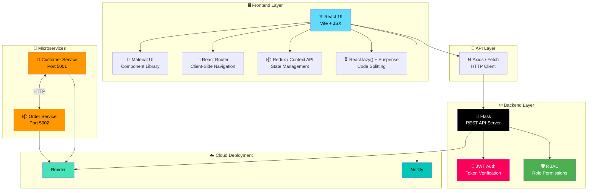

---

## 📊 Experiments At a Glance

| # | Experiment | Domain | Tech Stack | Key Concepts | Complexity |
|:-:|:-----------|:------:|:-----------|:-------------|:----------:|
| 1 | **React Basics & SPA** | Frontend | React, Vite | JSX, Components, Props, SPA vs MPA | ⭐ |
| 2 | **Material UI Components** | Frontend | React, MUI | UI Libraries, Theming, Responsive Design | ⭐⭐ |
| 3 | **React Router** | Frontend | React Router | Client-Side Routing, Navigation, Route Params | ⭐⭐ |
| 4 | **State Management** | Frontend | Redux, Context | Local State, Context API, Redux Store | ⭐⭐⭐ |
| 5 | **Lazy Loading** | Frontend | React.lazy | Code Splitting, Suspense, Performance | ⭐⭐⭐ |
| 7 | **RESTful APIs** | Backend | Flask, Python | CRUD Operations, Blueprints, REST | ⭐⭐⭐ |
| 8 | **JWT Authentication** | Backend | Flask-JWT | Basic Auth, Token Auth, JWT Bearer | ⭐⭐⭐⭐ |
| 9 | **RBAC Authorization** | Full Stack | Flask + React | Role Permissions, Access Control, CORS | ⭐⭐⭐⭐ |
| 10 | **Microservices** | Backend | Flask × 2 | Service Communication, Distributed Systems | ⭐⭐⭐⭐⭐ |

---

## 📝 Detailed Experiment Breakdown

---

### Experiment 1 — React Basics & Single Page Application

> **Objective:** Understand the fundamentals of React.js and differentiate between Single Page Applications (SPA) and Multi-Page Applications (MPA).

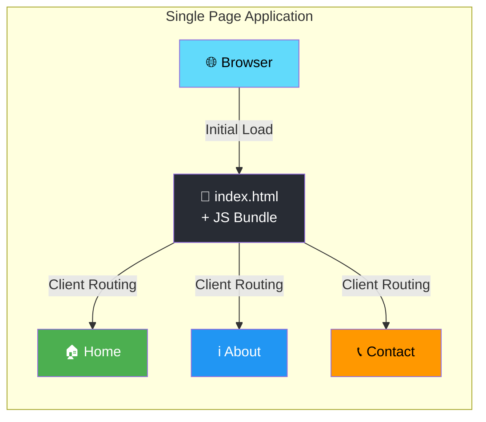

**Key Components Built:**
| Component | File | Description |
|-----------|------|-------------|
| `SinglePageApp` | `Spa.jsx` | Root SPA container with React Router |
| `Home` | `Home.jsx` | Landing page component |
| `About` | `About.jsx` | About section component |
| `Contact` | `Contact.jsx` | Contact form component |

**Learning Outcomes:**
- ✅ React.js fundamentals — JSX, components, props
- ✅ SPA vs MPA architecture differences
- ✅ Client-side routing with React Router
- ✅ Vite as a modern build tool

---

### Experiment 2 — Material UI Components

> **Objective:** Build professional, responsive user interfaces using Material UI (MUI) component library with React.

**Key Features:**
| MUI Component | Usage |
|---------------|-------|
| `AppBar` | Top navigation bar with brand color `#7b1c1c` |
| `Toolbar` | Action items container |
| `Button` | Navigation links as styled buttons |
| `Container` | Responsive content wrapper |

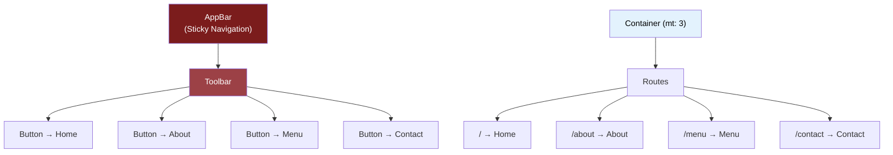

**Learning Outcomes:**
- ✅ Material UI integration with React
- ✅ `sx` prop for inline styling
- ✅ Component composition with MUI
- ✅ Responsive design patterns

---

### Experiment 3 — React Router & Client-Side Navigation

> **Objective:** Implement client-side routing using React Router to create seamless navigation without full page reloads.

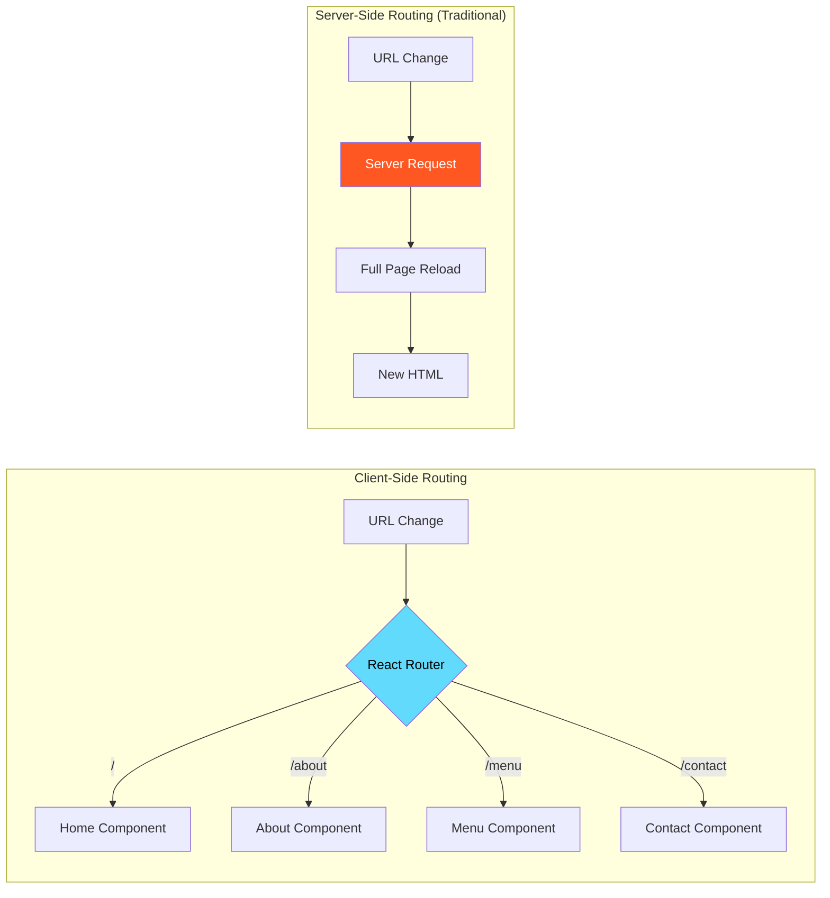

| Feature | Client-Side Routing | Server-Side Routing |
|---------|:-------------------:|:-------------------:|
| Page Reload | ❌ No | ✅ Yes |
| Speed | ⚡ Fast | 🐢 Slower |
| SEO | ⚠️ Needs SSR | ✅ Native |
| UX | 🎯 Smooth | 🔄 Flickering |
| Initial Load | 📦 Heavier | 📄 Lighter |

**Learning Outcomes:**
- ✅ React Router DOM setup and configuration
- ✅ `<Routes>`, `<Route>`, and `<Link>` components
- ✅ Client-side vs server-side routing
- ✅ Path-based component rendering

---

### Experiment 4 — State Management (Local, Context API & Redux)

> **Objective:** Explore and compare three state management approaches in React — Local State, Context API, and Redux.

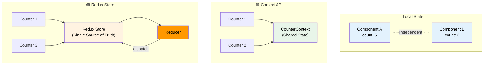

| Approach | Scope | Complexity | Best For |
|----------|:-----:|:----------:|:---------|
| **Local State** (`useState`) | Component | ⭐ Low | Simple, isolated UI state |
| **Context API** | Subtree | ⭐⭐ Medium | Theme, auth, shared config |
| **Redux** | Global | ⭐⭐⭐ High | Complex apps, many shared states |

**Learning Outcomes:**
- ✅ `useState` for local component state
- ✅ Context API with `createContext` and `useContext`
- ✅ Redux store, reducers, and `dispatch`
- ✅ When to use which state management strategy

---

### Experiment 5 — Lazy Loading & Code Splitting

> **Objective:** Optimize React application performance using `React.lazy()` and `Suspense` for on-demand component loading.

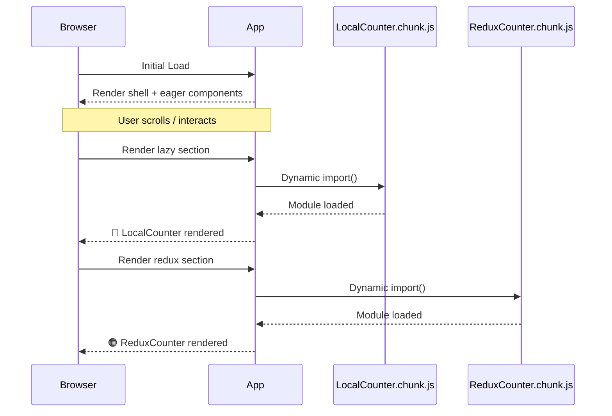

| Loading Strategy | Bundle Size | Initial Load | On-Demand |
|-----------------|:-----------:|:------------:|:---------:|
| **Eager (default)** | 📦 Large | 🐢 Slow | — |
| **Lazy Loading** | 📦 Small chunks | ⚡ Fast | ✅ Yes |

**Key Implementation:**
```jsx
// Lazy imports — loaded only when needed
const LocalCounter = lazy(() => import("./components/localstate/CounterState"));
const CounterReduxParent = lazy(() => import("./components/redux/CounterGlobalReduxParent"));

// Suspense boundary with fallback UI
<Suspense fallback={<h3>Loading...</h3>}>
  <LocalCounter />
</Suspense>
```

**Learning Outcomes:**
- ✅ `React.lazy()` for dynamic imports
- ✅ `Suspense` with fallback UI
- ✅ Webpack/Vite code splitting & chunking
- ✅ Performance optimization strategies

---


### Experiment 6 — Form Handling & Validation

> **Objective:** To understand and implement form handling in React using controlled components, React Hook Form, and Yup validation for building efficient, scalable, and user-friendly forms.

---

## 🧠 Introduction

Forms are a critical part of modern web applications. They are used for:

- User Registration & Login
- Profile Updates
- Data Collection (Surveys)
- Search & Filtering
- Checkout Systems

However, handling forms is challenging due to:

- Managing multiple input states
- Validation complexity
- Error handling
- Performance issues

This experiment focuses on solving these problems using modern React techniques.

---

## 🏗️ Working Flow

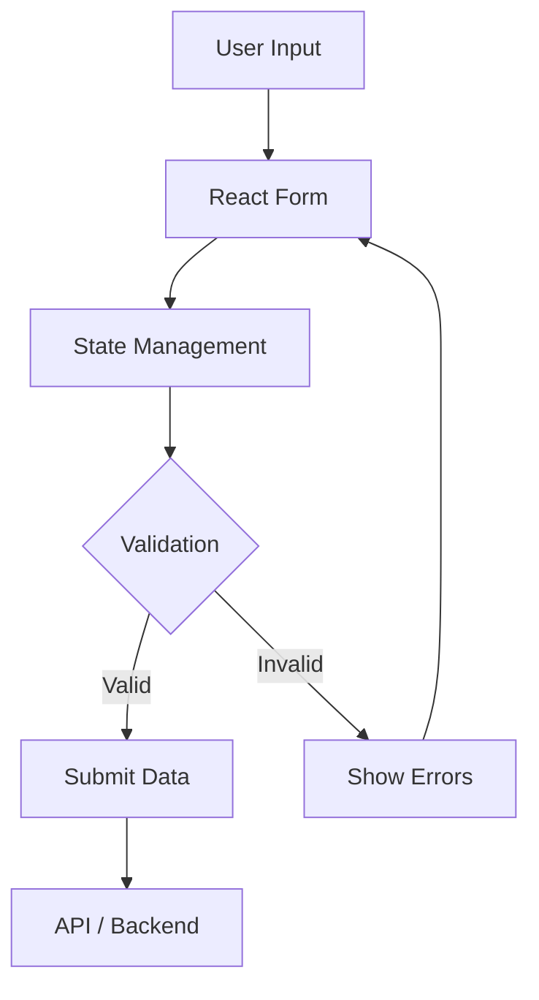


### Experiment 7 — RESTful APIs with Flask

> **Objective:** Develop a complete CRUD REST API for student management using the Flask backend framework.

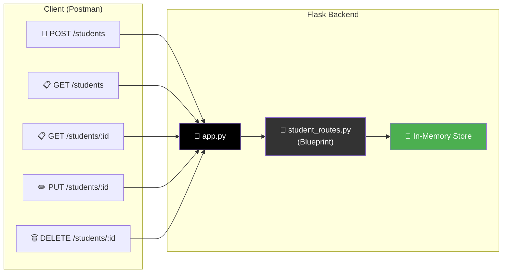

**API Endpoints:**

| Method | Endpoint | Description | Status Code |
|:------:|:---------|:------------|:-----------:|
| `POST` | `/students` | Create a new student record | `201` |
| `GET` | `/students` | Retrieve all students | `200` |
| `GET` | `/students/<id>` | Retrieve student by ID | `200` / `404` |
| `PUT` | `/students/<id>` | Update student record | `200` / `404` |
| `DELETE` | `/students/<id>` | Delete student record | `200` / `404` |

**🌐 Live Deployment:** [Render Link](https://two3bis70035-experiment-8.onrender.com)

**Learning Outcomes:**
- ✅ Flask application factory pattern
- ✅ Blueprints for modular route organization
- ✅ RESTful API design principles (CRUD)
- ✅ HTTP methods and status codes
- ✅ Cloud deployment on Render

---

### Experiment 8 — JWT Authentication

> **Objective:** Implement and compare three authentication methods — Basic Auth, Token-based Auth, and JWT (JSON Web Token) Auth.

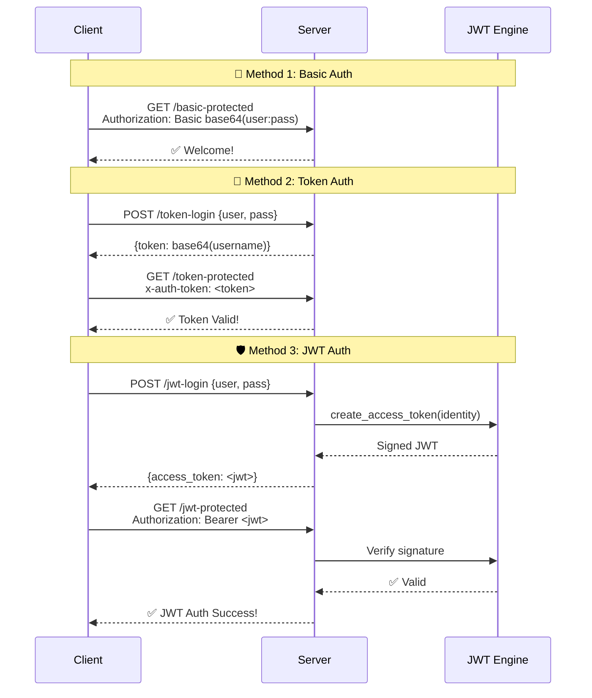

**Authentication Methods Comparison:**

| Method | Header | Stateless | Security | Token Expiry |
|:-------|:-------|:---------:|:--------:|:------------:|
| 🔑 **Basic Auth** | `Authorization: Basic` | ✅ | 🟡 Weak | ❌ |
| 🎫 **Token Auth** | `x-auth-token` | ✅ | 🔴 Very Weak | ❌ |
| 🛡️ **JWT Auth** | `Authorization: Bearer` | ✅ | 🟢 Strong | ✅ |

**API Endpoints:**

| Method | Endpoint | Description |
|:------:|:---------|:------------|
| `GET` | `/basic-protected` | Basic Authentication protected route |
| `POST` | `/token-login` | Generate simple Base64 token |
| `GET` | `/token-protected` | Access via `x-auth-token` header |
| `POST` | `/jwt-login` | Generate JWT access token |
| `GET` | `/jwt-protected` | Access via JWT Bearer token |

**Learning Outcomes:**
- ✅ Basic HTTP authentication
- ✅ Custom token-based authentication
- ✅ JWT creation, signing, and verification
- ✅ Flask-JWT-Extended library usage
- ✅ Security comparison of auth methods

---

### Experiment 9 — Role-Based Access Control (RBAC)

> **Objective:** Implement a full-stack RBAC system where resource access is controlled based on user roles (Admin vs User).

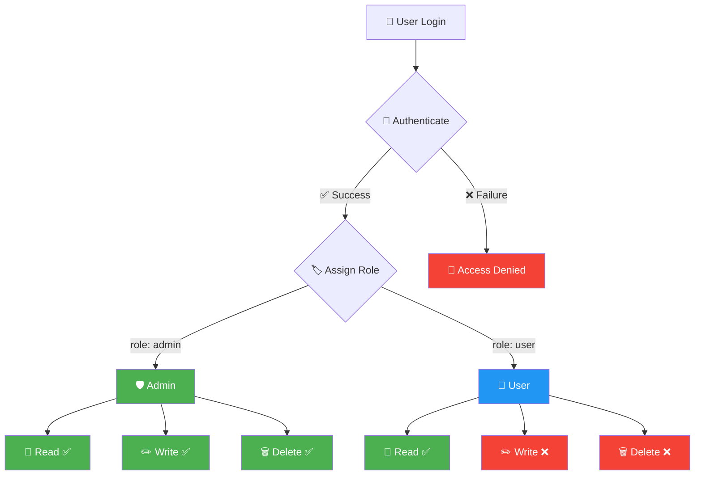

**Permission Matrix:**

| Role | `read` | `write` | `delete` | Scope |
|:-----|:------:|:-------:|:--------:|:------|
| 🛡️ **Admin** | ✅ | ✅ | ✅ | Full control |
| 👤 **User** | ✅ | ❌ | ❌ | Read-only access |

**Architecture:**
```
┌─────────────┐       HTTP/Axios       ┌─────────────────┐
│  React App  │ ◄──────────────────► │  Flask Backend  │
│  (Netlify)  │    role in headers    │   (Render)      │
└─────────────┘                       └─────────────────┘
```

**🌐 Live Links:**
- **Frontend:** [Netlify](https://23bis70035experiment10.netlify.app/)
- **Backend:** [Render](https://two3bis70035-experiment-10.onrender.com)

**Learning Outcomes:**
- ✅ RBAC design pattern implementation
- ✅ Role-permission mapping
- ✅ Full-stack integration (React + Flask)
- ✅ CORS configuration for cross-origin requests
- ✅ Dual-platform deployment (Netlify + Render)

---

### Experiment 10 — Microservices Architecture

> **Objective:** Build a distributed microservices system with independently deployable services that communicate over HTTP.

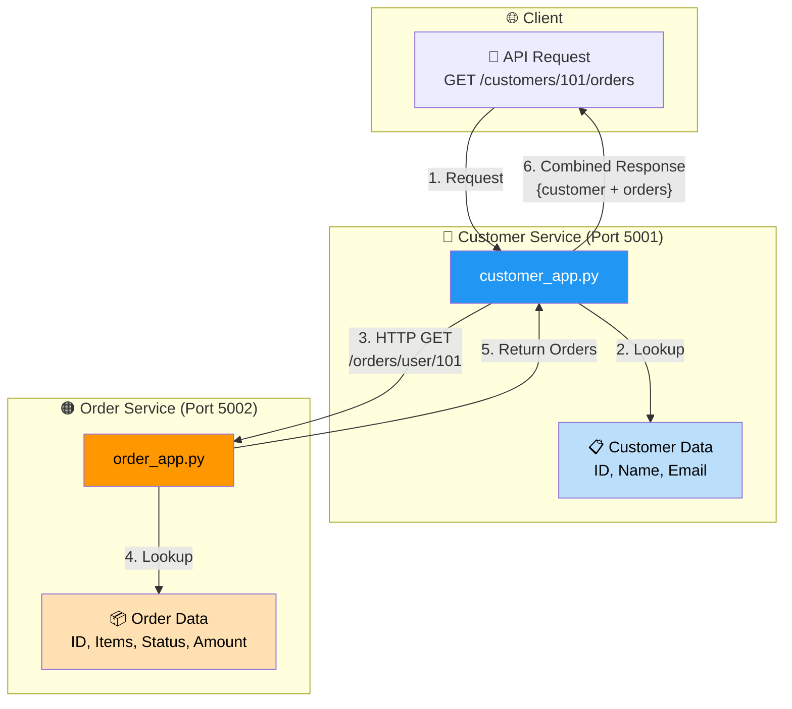

**Service Endpoints:**

| Service | Method | Endpoint | Description |
|:--------|:------:|:---------|:------------|
| 👤 **Customer** | `GET` | `/customers/<id>/orders` | Get customer + their orders |
| 📦 **Order** | `GET` | `/orders/user/<user_id>` | Get orders for a user |
| 📦 **Order** | `PUT` | `/orders/<order_id>/status` | Update order status |

**Sample Data Flow:**
```json
// GET /customers/101/orders → Combined Response
{
  "customer": {
    "id": 101,
    "name": "Customer-1",
    "email": "customer-1@example.com"
  },
  "orders": [
    {
      "id": 1,
      "order_amount": 2500,
      "order_status": "Shipped",
      "items": [
        {"name": "Laptop", "quantity": 1, "price": 2000},
        {"name": "Mouse", "quantity": 2, "price": 250}
      ]
    }
  ]
}
```

**🌐 Live Deployments:**
- **Customer Service:** [Render](https://two3bis70035-experiment-11-customer.onrender.com)
- **Order Service:** [Render](https://two3bis70035-experiment-11-order.onrender.com)

**Learning Outcomes:**
- ✅ Microservices architecture design
- ✅ Inter-service HTTP communication
- ✅ Independent deployment of services
- ✅ Error handling in distributed systems
- ✅ Cloud deployment of multiple services

---

## 📈 Learning Progression

```mermaid
graph LR
    A["1️⃣ React<br/>Basics"] --> B["2️⃣ Material<br/>UI"]
    B --> C["3️⃣ React<br/>Router"]
    C --> D["4️⃣ State<br/>Management"]
    D --> E["5️⃣ Lazy<br/>Loading"]
    E --> F["7️⃣ REST<br/>APIs"]
    F --> G["8️⃣ JWT<br/>Auth"]
    G --> H["9️⃣ RBAC"]
    H --> I["🔟 Micro<br/>services"]

    style A fill:#E3F2FD,color:#000
    style B fill:#BBDEFB,color:#000
    style C fill:#90CAF9,color:#000
    style D fill:#64B5F6,color:#fff
    style E fill:#42A5F5,color:#fff
    style F fill:#2196F3,color:#fff
    style G fill:#1E88E5,color:#fff
    style H fill:#1565C0,color:#fff
    style I fill:#0D47A1,color:#fff
```

| Phase | Experiments | Skills Acquired |
|:------|:------------|:----------------|
| **🎨 Frontend Foundations** | 1, 2, 3 | React, JSX, Components, MUI, Routing |
| **⚙️ Advanced Frontend** | 4, 5 | State Management, Redux, Performance Optimization |
| **🐍 Backend Development** | 7 | REST APIs, Flask, CRUD, Blueprints |
| **🔐 Security** | 8, 9 | Authentication, JWT, Authorization, RBAC |
| **🏢 Architecture** | 10 | Microservices, Distributed Systems, Service Communication |

---

## 🌐 Deployment Links

| Experiment | Platform | URL |
|:-----------|:--------:|:----|
| Exp 7 — REST API | Render | [two3bis70035-experiment-8.onrender.com](https://two3bis70035-experiment-8.onrender.com) |
| Exp 9 — RBAC Backend | Render | [two3bis70035-experiment-10.onrender.com](https://two3bis70035-experiment-10.onrender.com) |
| Exp 9 — RBAC Frontend | Netlify | [23bis70035experiment10.netlify.app](https://23bis70035experiment10.netlify.app/) |
| Exp 10 — Customer Service | Render | [two3bis70035-experiment-11-customer.onrender.com](https://two3bis70035-experiment-11-customer.onrender.com) |
| Exp 10 — Order Service | Render | [two3bis70035-experiment-11-order.onrender.com](https://two3bis70035-experiment-11-order.onrender.com) |

---

## 🚀 Getting Started

### Prerequisites

```bash
node --version    # v18+ required
npm --version     # v9+ required
python --version  # 3.8+ required
```

### Running Frontend Experiments (1–5)

```bash
# Clone the repository
git clone https://github.com/Shubhanshu-ydv/FSD-Experiments.git
cd FSD-Experiments

# Navigate to any frontend experiment
cd Experiment_1

# Install dependencies
npm install

# Start development server
npm run dev
```

### Running Backend Experiments (7–10)

```bash
# Navigate to backend experiment
cd Experiment_7

# Create virtual environment
python -m venv venv

# Activate virtual environment
# Windows:
venv\Scripts\activate
# macOS/Linux:
source venv/bin/activate

# Install dependencies
pip install -r requirements.txt

# Run the server
python run.py
```

---

## 📁 Project Structure

```
FSD-Experiments/
│
├── Experiment_1/          # ⚛️ React Basics & SPA
│   ├── src/
│   │   ├── components/    # Home, About, Contact, Spa
│   │   ├── App.jsx
│   │   └── main.jsx
│   └── package.json
│
├── Experiment_2/          # 🎨 Material UI Components
│   ├── src/
│   │   ├── components/    # MUI-styled components
│   │   └── App.jsx
│   └── package.json
│
├── Experiment_3/          # 🔀 React Router Navigation
│   ├── src/
│   │   ├── components/    # Routed pages
│   │   └── App.jsx
│   └── package.json
│
├── Experiment_4/          # 📦 State Management
│   ├── src/
│   │   ├── components/
│   │   │   ├── localstate/      # useState
│   │   │   ├── contextapi/      # Context API
│   │   │   └── redux/           # Redux Toolkit
│   │   ├── store/               # Redux store config
│   │   └── App.jsx
│   └── package.json
│
├── Experiment_5/          # ⏳ Lazy Loading
│   ├── src/
│   │   ├── components/    # Lazy-loaded components
│   │   └── App.jsx        # React.lazy + Suspense
│   └── package.json
│
├── Experiment_7/          # 🐍 RESTful API (Flask)
│   ├── routes/
│   │   └── student_routes.py
│   ├── app.py
│   ├── run.py
│   └── requirements.txt
│
├── Experiment_8/          # 🔐 JWT Authentication
│   ├── app.py             # Basic, Token & JWT Auth
│   └── requirements.txt
│
├── Experiment_9/          # 🛡️ RBAC (Full Stack)
│   ├── backend/
│   │   ├── app.py
│   │   └── requirements.txt
│   └── frontend/
│       ├── src/
│       └── package.json
│
├── Experiment_10/         # 🏢 Microservices
│   └── micro-services-lab/
│       ├── customer-service/
│       │   └── customer_app.py
│       └── order-service/
│           └── order_app.py
│
└── README.md              # 📖 You are here!
```

---

## 📄 License

This project is created for **academic purposes** as part of the Full Stack Development course curriculum.

---

<p align="center">
  <b>Built with ❤️ using React, Flask & a lot of ☕</b><br/>
  <sub>⭐ Star this repo if you found it helpful!</sub>
</p>
